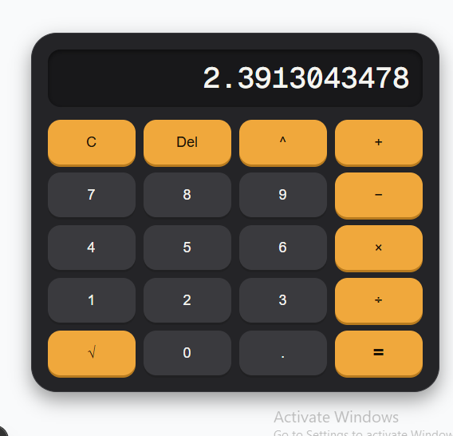

# Calculator App

A fully functional calculator built with React, Next.js, and Tailwind CSS, 
featuring a custom dark-themed UI with tactile, "pressable" buttons.

## Live demo
https://calculator001-five.vercel.app/

## Features
- Standard arithmetic: addition, subtraction, multiplication, division
- Exponentiation (^)
- Square root (√)
- Clear (C) and backspace (Del) to delete one digit at a time
- Decimal point support
- Custom dark UI with raised, tactile button styling

## Tech stack
- React
- Next.js
- TypeScript
- Tailwind CSS

## Getting started

Clone the repo and install dependencies:
```bash
git clone https://github.com/Gabrielle-001-dike/Calculator001.git

cd Calculator001
npm install
```

Run the development server:
```bash
npm run dev
```

Open [http://localhost:3000](http://localhost:3000) in your browser.

## Screenshot


## What I learned
Built while learning React and Next.js — this project helped me understand 
component state management, event handling, and debugging common React pitfalls 
(like avoiding defining components inside other components, which was a bug 
I ran into and fixed during development).